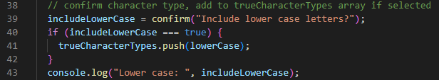
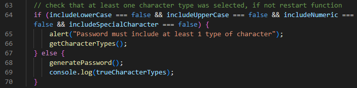
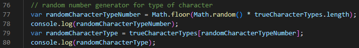

# Password-Generator
This application can be used to generate random passwords based on specified input criteria.

## Description
This project takes the static base for a webpage to generate random passwords and adds the javascript needed to make it interactive. The site prompts the user with queries about the desired length of password and type of characters to include (lower case, upper case, numbers, and special characters). It then generates a random password based on the user inputs and displays it.

### Deployed Application
[Password-Generator](https://briceveyna.github.io/Password-Generator/)

### Badges
 

## Usage
To initialize this program, simply click the generate password button.

You will first be prompted with a pop-up asking to input the number value for your desired password length.

You will then be asked in a series of pop-ups to confirm which character types to include in the password.

If you enter an invalid response to the length pop-up, you will be told the password length parameters again and prompted again to enter a valid number. If you do not select at least one character type, you will also be told the character type parameter again and repeat the character selection process.

Once all the inputs have been given, your new password will be displayed in the central text field.

## Features
There were many javascript operations demonstrated throughout the course of this project that interact to produce the end product. Some of these include the prompt, confirm, and alert methods to display dialog boxes. These methods, such as the one shown below:

can be used to display a message to the user and gather information from them in response. Another useful tool is also on display, as the user respose is displayed to the console for developer feedback as to the functionality of the program. Boundary condition checks are also another neccessary component in an application such as this. In the below example, an alert message is sent to the user if no character types are selected and the function is looped back to the start. If there is at least one, it is allowed to continue.

The actual random number generation is accomplished by applying a random number operation to the length of an array containing the character types set up in the confirm statements. This number is then used to select a character type array. A similar process is done for subsequently pulling a value from that array to be used as the final character value.

## Questions
If you have any additional questions, feel free to reach out.
- [Github](https://github.com/BriceVeyna)
- [LinkedIn](https://www.linkedin.com/in/brice-veyna/)
- Email: briceveyna@gmail.com

## License
Brice Veyna's Family Memories is licensed under the [MIT License](https://opensource.org/licenses/MIT).

Copyright 2022 Brice Veyna

Permission is hereby granted, free of charge, to any person obtaining a copy of this software and associated documentation files (the "Software"), to deal in the Software without restriction, including without limitation the rights to use, copy, modify, merge, publish, distribute, sublicense, and/or sell copies of the Software, and to permit persons to whom the Software is furnished to do so, subject to the following conditions:

The above copyright notice and this permission notice shall be included in all copies or substantial portions of the Software.

THE SOFTWARE IS PROVIDED "AS IS", WITHOUT WARRANTY OF ANY KIND, EXPRESS OR IMPLIED, INCLUDING BUT NOT LIMITED TO THE WARRANTIES OF MERCHANTABILITY, FITNESS FOR A PARTICULAR PURPOSE AND NONINFRINGEMENT. IN NO EVENT SHALL THE AUTHORS OR COPYRIGHT HOLDERS BE LIABLE FOR ANY CLAIM, DAMAGES OR OTHER LIABILITY, WHETHER IN AN ACTION OF CONTRACT, TORT OR OTHERWISE, ARISING FROM, OUT OF OR IN CONNECTION WITH THE SOFTWARE OR THE USE OR OTHER DEALINGS IN THE SOFTWARE.